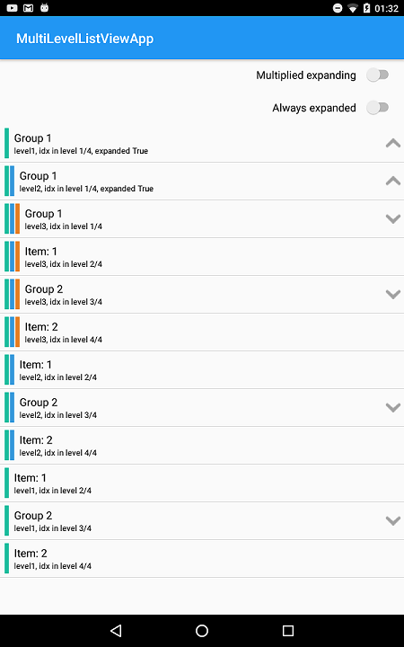

# MultiLevelListView
This is a Xamarin Android example that uses a Binding project to access an native Android AAR

The native Android library used is [this](https://github.com/open-rnd/android-multi-level-listview)

 
